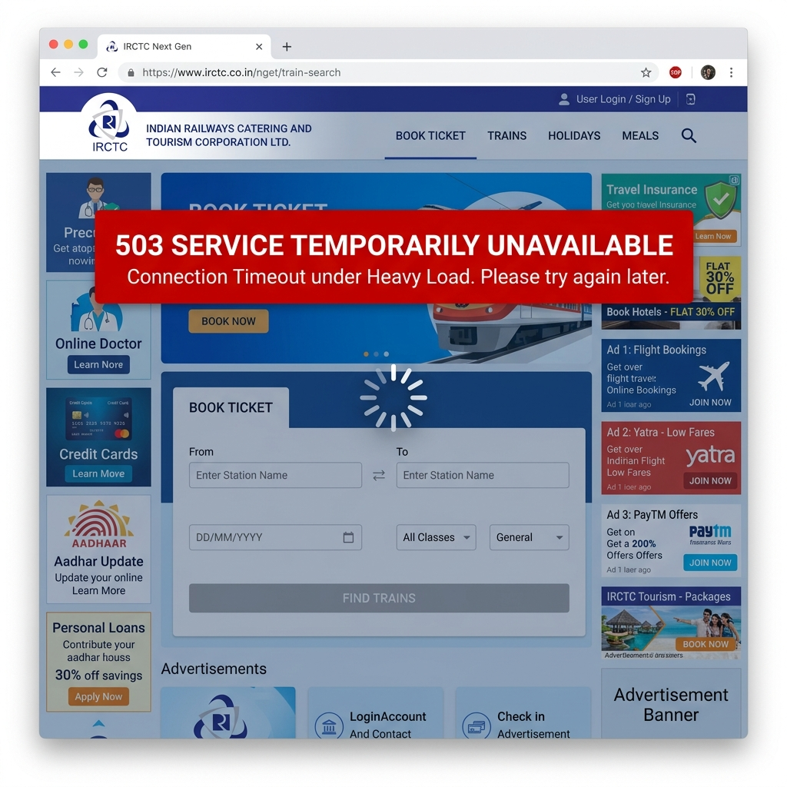
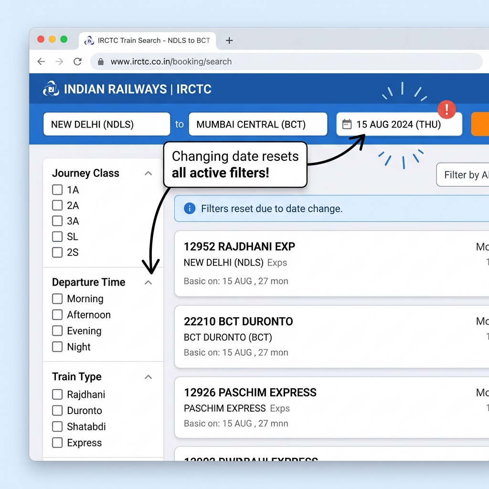
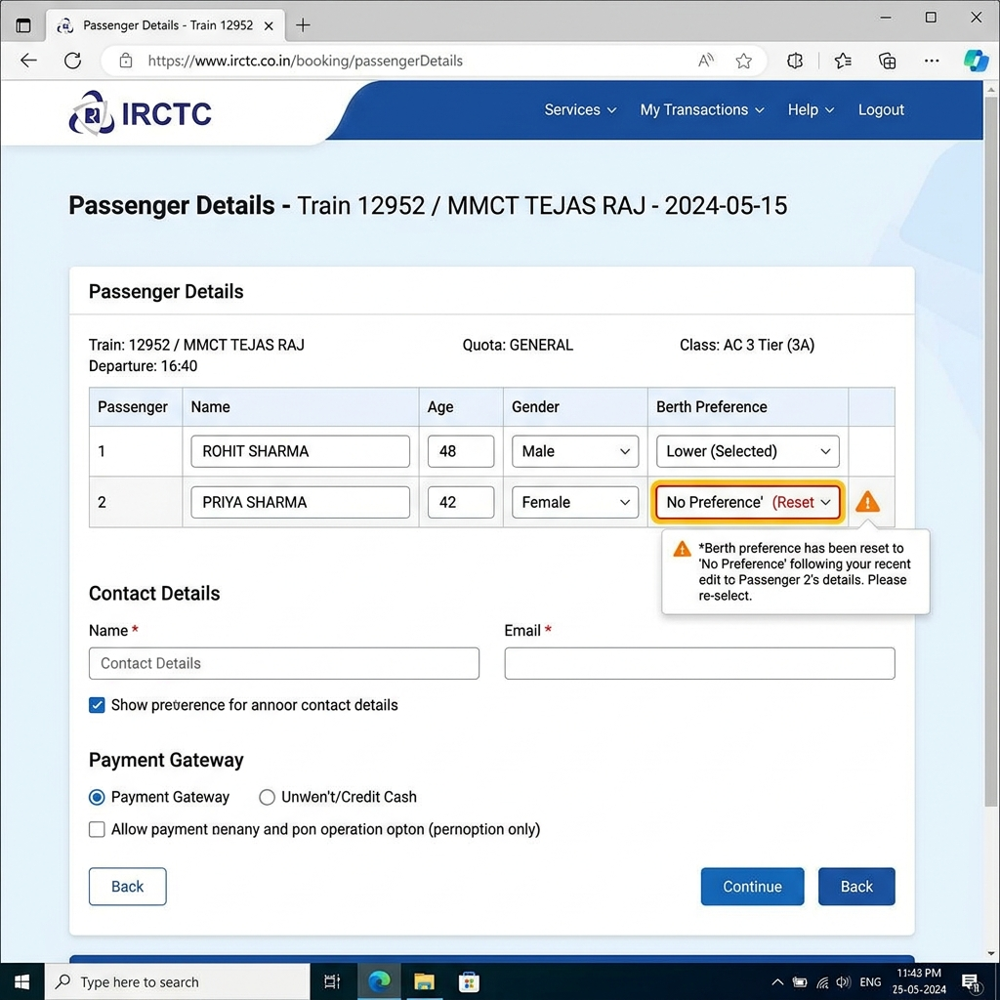

# Part A — IRCTC Problem Discovery: 6 Pain Points Documented

Indian Railways Catering and Tourism Corporation (IRCTC) handles millions of ticket bookings daily. While it is a critical utility, the platform’s user experience suffers from several severe UX design patterns, architectural limitations, and usability bugs. This document examines six major pain points.

---

## 1. Tatkal Booking Peak-Hour Server Crash

### What is broken
Under extreme traffic loads at 10:00 AM (AC bookings) and 11:00 AM (Non-AC bookings), the platform's backend servers frequently crash or refuse connections. Users face infinite loading loops, immediate logouts, and payment gateways failures (money is debited but no ticket is generated). The site acts as a server-concurrency bottleneck, resulting in HTTP 503 Service Unavailable or generic system error messages instead of gracefully queueing traffic.

### Who is affected
Every day, millions of middle-class and working-class passengers in India who need emergency, last-minute travel tickets under the Tatkal quota.

### Frequency
High. Occurs daily during peak Tatkal hours: 10:00 AM to 10:15 AM, and 11:00 AM to 11:15 AM.

### Current flow
1. User logs into the IRCTC account at 9:58 AM.
2. User enters source, destination, and sets the travel date for the next day.
3. User selects "TATKAL" from the Quota dropdown and clicks "Search".
4. At exactly 10:00 AM, the user clicks the availability class button (e.g., "3A") to load seats.
5. The interface hangs showing a spinner. The server often drops the session, returning the user to the login screen, or shows a "Service Unavailable" error page.
6. If the user manages to bypass the loading screen, they enter passenger details under extreme time pressure.
7. User inputs the case-sensitive captcha and clicks "Continue" to proceed to payment.
8. The payment processing page times out or fails during checkout. The money is deducted from the bank account, but the session is lost, resulting in a booking failure.

### Where it breaks
The failure occurs primarily at the **Availability Class Check** (Step 4), **Form Submission Captcha Verification** (Step 7), or **Payment Handshake** (Step 8).

### Screenshot

---

## 2. Search Filter Reversion & Reset on Modification

### What is broken
When a user filters search results (e.g., selecting specific coach classes like 3A/2A, filter by departure/arrival times, or train types like Rajdhani/Shatabdi), these settings are entirely client-side and ephemeral. If the user edits their query (such as clicking the "Next Day" date-shifter button or clicking "Modify Search"), the system discards the filters and reloads the full, unfiltered train list. Users must re-apply their desired filters on every search adjustment.

### Who is affected
Commuters, business travelers, and families who need to compare train availability, departure times, or classes across multiple days to find the best itinerary.

### Frequency
Constant. Happens 100% of the time whenever a search parameter is adjusted or the date is shifted.

### Current flow
1. User searches for trains between Station A and Station B on a specific date.
2. User applies filters on the left panel (e.g., Class: 3A and 2A, Departure Time: 06:00 - 12:00, Train Type: Rajdhani).
3. The results list updates to show only relevant trains.
4. User wants to check if there are better timings or more vacant seats on the next day.
5. User clicks the "Next Day" tab at the top of the results page.
6. The page reloads the trains for the new date, but the left filter panel is completely cleared (all classes and times are unchecked).
7. The user is forced to re-check all their preferences to filter the list again.

### Where it breaks
The client-side UI filter state is not preserved when the page makes a new query API request, causing a complete reset of the sidebar component state.

### Screenshot

---

## 3. Silent Reset of Seat/Berth Preferences

### What is broken
The passenger details form allows users to select berth preferences (e.g., Lower, Middle, Upper, Side Lower). However, the form state is extremely fragile. If the user makes an edit to any other field in the passenger row (such as modifying the name typo, adding/changing age, or adding a new passenger row), the berth preference dropdown silently resets to "No Preference". There is no warning or visual alert indicating that the selection was reset.

### Who is affected
Families traveling together, elderly passengers, and disabled individuals who strictly require specific seating arrangements (like Lower Berths) for comfort or safety.

### Frequency
High. Occurs almost every time an active form row is edited or a passenger's details are modified post-selection.

### Current flow
1. User clicks "Book Now" on a selected train class.
2. User enters passenger details: Name, Age, Gender.
3. User selects "Lower Berth" in the Berth Preference dropdown.
4. User notices they misspelled the passenger's name or typed the wrong age, and clicks the input box to edit the field.
5. The form component refreshes to save changes or triggers validation check.
6. The "Berth Preference" dropdown silently reverts from "Lower Berth" to the default "No Preference".
7. User, under pressure to book quickly before seats run out, submits the form without noticing the reset.
8. The ticket is booked, but the passenger is assigned a middle/upper berth because the selection was reset.

### Where it breaks
The form's state-management logic in the front-end code (typically react/angular binding) resets dropdown inputs to default values during parent row re-renders or edits.

### Screenshot

