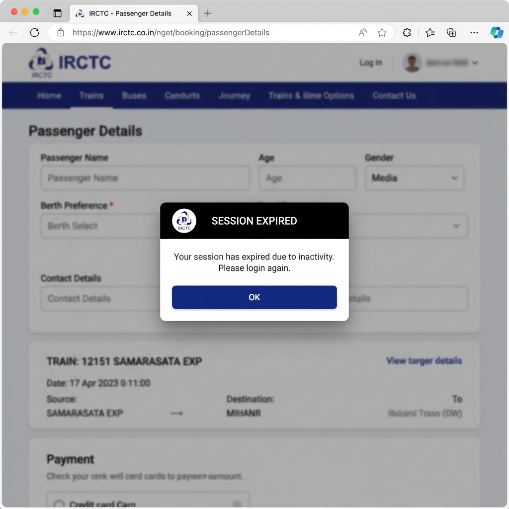
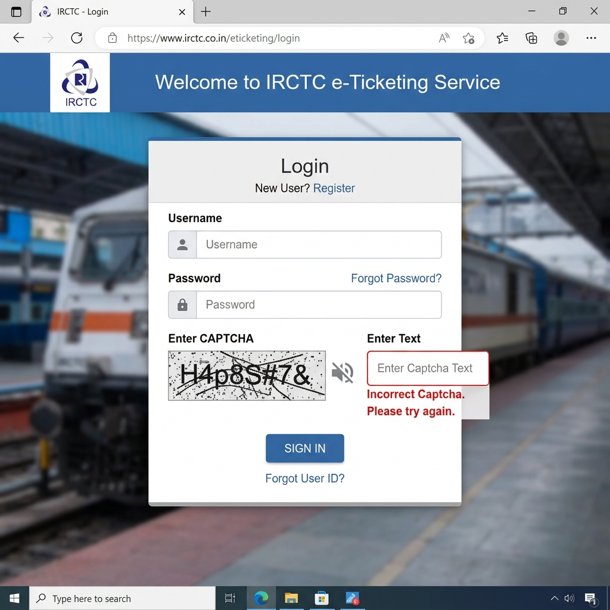
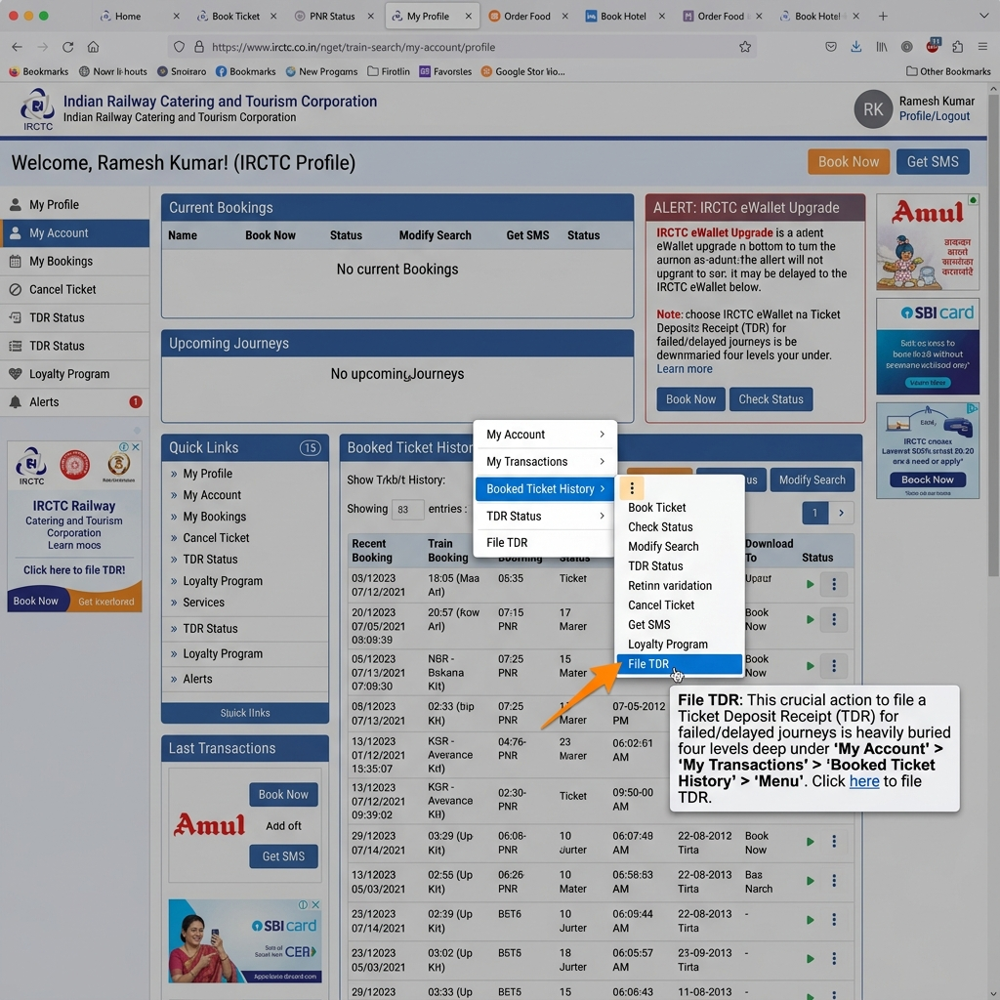

# Part A — IRCTC Problem Discovery: 6 Pain Points Documented

Indian Railways Catering and Tourism Corporation (IRCTC) handles millions of ticket bookings daily. While it is a critical utility, the platform’s user experience suffers from several severe UX design patterns, architectural limitations, and usability bugs. This document examines six major pain points.

---

## 1. Tatkal Booking Peak-Hour Server Crash

### What is broken
Under extreme traffic loads at 10:00 AM (AC bookings) and 11:00 AM (Non-AC bookings), the platform's backend servers frequently crash or refuse connections. Users face infinite loading loops, immediate logouts, and payment gateways failures (money is debited but no ticket is generated). The site acts as a server-concurrency bottleneck, resulting in HTTP 503 Service Unavailable or generic system error messages instead of gracefully queueing traffic.

### Who is affected
Every day, millions of middle-class and working-class passengers in India who need emergency, last-minute travel tickets under the Tatkal quota.

### Frequency
High. Occurs daily during peak Tatkal hours: 10:00 AM to 10:15 AM, and 11:00 AM to 11:15 AM.

### Current flow
1. User logs into the IRCTC account at 9:58 AM.
2. User enters source, destination, and sets the travel date for the next day.
3. User selects "TATKAL" from the Quota dropdown and clicks "Search".
4. At exactly 10:00 AM, the user clicks the availability class button (e.g., "3A") to load seats.
5. The interface hangs showing a spinner. The server often drops the session, returning the user to the login screen, or shows a "Service Unavailable" error page.
6. If the user manages to bypass the loading screen, they enter passenger details under extreme time pressure.
7. User inputs the case-sensitive captcha and clicks "Continue" to proceed to payment.
8. The payment processing page times out or fails during checkout. The money is deducted from the bank account, but the session is lost, resulting in a booking failure.

### Where it breaks
The failure occurs primarily at the **Availability Class Check** (Step 4), **Form Submission Captcha Verification** (Step 7), or **Payment Handshake** (Step 8).

### Screenshot

---

## 2. Search Filter Reversion & Reset on Modification

### What is broken
When a user filters search results (e.g., selecting specific coach classes like 3A/2A, filter by departure/arrival times, or train types like Rajdhani/Shatabdi), these settings are entirely client-side and ephemeral. If the user edits their query (such as clicking the "Next Day" date-shifter button or clicking "Modify Search"), the system discards the filters and reloads the full, unfiltered train list. Users must re-apply their desired filters on every search adjustment.

### Who is affected
Commuters, business travelers, and families who need to compare train availability, departure times, or classes across multiple days to find the best itinerary.

### Frequency
Constant. Happens 100% of the time whenever a search parameter is adjusted or the date is shifted.

### Current flow
1. User searches for trains between Station A and Station B on a specific date.
2. User applies filters on the left panel (e.g., Class: 3A and 2A, Departure Time: 06:00 - 12:00, Train Type: Rajdhani).
3. The results list updates to show only relevant trains.
4. User wants to check if there are better timings or more vacant seats on the next day.
5. User clicks the "Next Day" tab at the top of the results page.
6. The page reloads the trains for the new date, but the left filter panel is completely cleared (all classes and times are unchecked).
7. The user is forced to re-check all their preferences to filter the list again.

### Where it breaks
The client-side UI filter state is not preserved when the page makes a new query API request, causing a complete reset of the sidebar component state.

### Screenshot

---

## 3. Silent Reset of Seat/Berth Preferences

### What is broken
The passenger details form allows users to select berth preferences (e.g., Lower, Middle, Upper, Side Lower). However, the form state is extremely fragile. If the user makes an edit to any other field in the passenger row (such as modifying the name typo, adding/changing age, or adding a new passenger row), the berth preference dropdown silently resets to "No Preference". There is no warning or visual alert indicating that the selection was reset.

### Who is affected
Families traveling together, elderly passengers, and disabled individuals who strictly require specific seating arrangements (like Lower Berths) for comfort or safety.

### Frequency
High. Occurs almost every time an active form row is edited or a passenger's details are modified post-selection.

### Current flow
1. User clicks "Book Now" on a selected train class.
2. User enters passenger details: Name, Age, Gender.
3. User selects "Lower Berth" in the Berth Preference dropdown.
4. User notices they misspelled the passenger's name or typed the wrong age, and clicks the input box to edit the field.
5. The form component refreshes to save changes or triggers validation check.
6. The "Berth Preference" dropdown silently reverts from "Lower Berth" to the default "No Preference".
7. User, under pressure to book quickly before seats run out, submits the form without noticing the reset.
8. The ticket is booked, but the passenger is assigned a middle/upper berth because the selection was reset.

### Where it breaks
The form's state-management logic in the front-end code (typically react/angular binding) resets dropdown inputs to default values during parent row re-renders or edits.

### Screenshot

---

## 4. Aggressive & Silent Session Timeouts

### What is broken
For security reasons, IRCTC implements a highly aggressive session timeout mechanism (usually between 3 to 5 minutes of inactivity). However, the system does not display an active countdown timer or warn the user that their session is about to expire. The timeout happens silently. The next action (such as submitting passenger details, clicking "Continue", or initiating payment) immediately logs out the user, showing a generic "Session Expired" alert, and completely deletes all form inputs, forcing the user to restart from search results.

### Who is affected
Elderly passengers, slow typers, individuals double-checking passport/ID details, and passengers with visual or motor impairments who require more time to navigate and complete web forms.

### Frequency
High. Occurs on almost every transaction flow where the user spends more than 3-5 minutes on passenger entry or payment page review.

### Current flow
1. User searches for a train and clicks "Book Now" to reach the passenger entry screen.
2. User begins entering passenger details for a group of four passengers, manually typing names, ages, ID card numbers, and food preferences.
3. Since they are typing carefully and cross-referencing ID details, they spend approximately 4 minutes on the page.
4. The server session expires silently in the background without any pop-up warning or notification.
5. User completes the captcha at the bottom of the page and clicks "Continue".
6. Instead of loading the review screen, the browser reloads the login screen and throws a generic modal: "Session Expired. Please log in again."
7. All entered passenger data is deleted, and the user must start the entire process from the search page.

### Where it breaks
Session management layer on the client and server side, where inactivity is handled silently without triggering client-side warnings or saving draft state.

### How I found it
Verified by opening the IRCTC portal, navigating to the booking page, waiting 4 minutes without clicking, and then trying to proceed. The session timed out silently and redirected to the login page.

### Screenshot

---

## 5. Multi-Stage Captcha Verification Failures and Accessibility Barriers

### What is broken
The IRCTC platform enforces distorted alphanumeric captchas at multiple stages (both at Login and right before Payment) to prevent automated bot scripts. However, these captchas are poorly designed, highly noisy, and case-sensitive, making them extremely difficult for human eyes to read. Even worse, the audio captcha feature is completely broken, either failing to play or outputting unintelligible noise. Under high server load (e.g., during Tatkal bookings), correct captchas are often flagged as incorrect due to latency issues, locking users in a frustrating verification loop.

### Who is affected
Visually impaired users, users with reading difficulties (dyslexia), and all general users under severe time constraints during Tatkal bookings.

### Frequency
High. Captcha entry is mandatory on 100% of bookings, and error loops happen frequently during high-traffic hours.

### Current flow
1. User logs in or reaches the booking confirmation step before proceeding to payment.
2. An extremely distorted image containing numbers and letters (with overlapping lines and background noise) is shown.
3. User attempts to read the characters, but confuses similar shapes (e.g., 'O' and '0', 'l' and '1', or case differences).
4. User enters the guess. The page reloads saying "Invalid Captcha Code".
5. User attempts to use the "Audio Captcha" feature for assistance.
6. The audio icon fails to load, or plays distorted static noise that has no correlation to the characters, making it useless.
7. The user is locked out of logging in or misses their Tatkal slot because the seat quota fills up in seconds.

### Where it breaks
The Captcha verification widget at Login and Review Booking stages.

### How I found it
Tested the login and review steps multiple times. Observed that the captcha images have poor contrast and the audio captcha is consistently broken or unplayable.

### Screenshot

---

## 6. Obscure and Nested Ticket Cancellation & TDR Filing

### What is broken
When a train is delayed by over 3 hours or a passenger cannot travel, they are entitled to a full or partial refund. However, the features to cancel a ticket and file a TDR (Ticket Deposit Receipt) are intentionally obscured in the UI. Instead of being accessible from the main dashboard, the active bookings page, or a prominent "Manage Booking" button, they are hidden under nested sub-menus in the user profile. The UI does not provide simple explanations of refund rules; instead, it forces users to decipher a long list of warning codes and links to external PDF tables.

### Who is affected
Passengers dealing with sudden train delays, cancellations, or emergency travel changes.

### Frequency
Constant. Happens 100% of the time whenever a passenger needs to cancel a ticket or file a TDR.

### Current flow
1. User learns their train is delayed by over 3 hours and wants to file a TDR for a refund.
2. User opens the IRCTC homepage. There is no link or button on the main navigation panel for "TDR" or "Quick Cancellation".
3. User must click "My Account" -> "My Transactions" -> "Booked Ticket History".
4. User scrolls through past bookings to find the active ticket.
5. The options to "Cancel Ticket" and "File TDR" are hidden under a tiny three-dot menu icon or a small link at the bottom of the ticket page.
6. Clicking "File TDR" opens a form with a dropdown list of obscure reason codes (e.g., "TDR Rule 1") without detailed descriptions of the refund percentage or rules.
7. The user must click an external PDF link to open a 10-page document explaining the refund schedule, leaving them guessing about the status of their money.

### Where it breaks
The Booking History page and Transaction Management sub-menus, which lack a direct cancellation/TDR widget on the dashboard.

### How I found it
Inspected the IRCTC user dashboard. Found that there is no direct link to cancel or file TDR from the landing page or active bookings widget, requiring 4-5 clicks through nested menus.

### Screenshot

