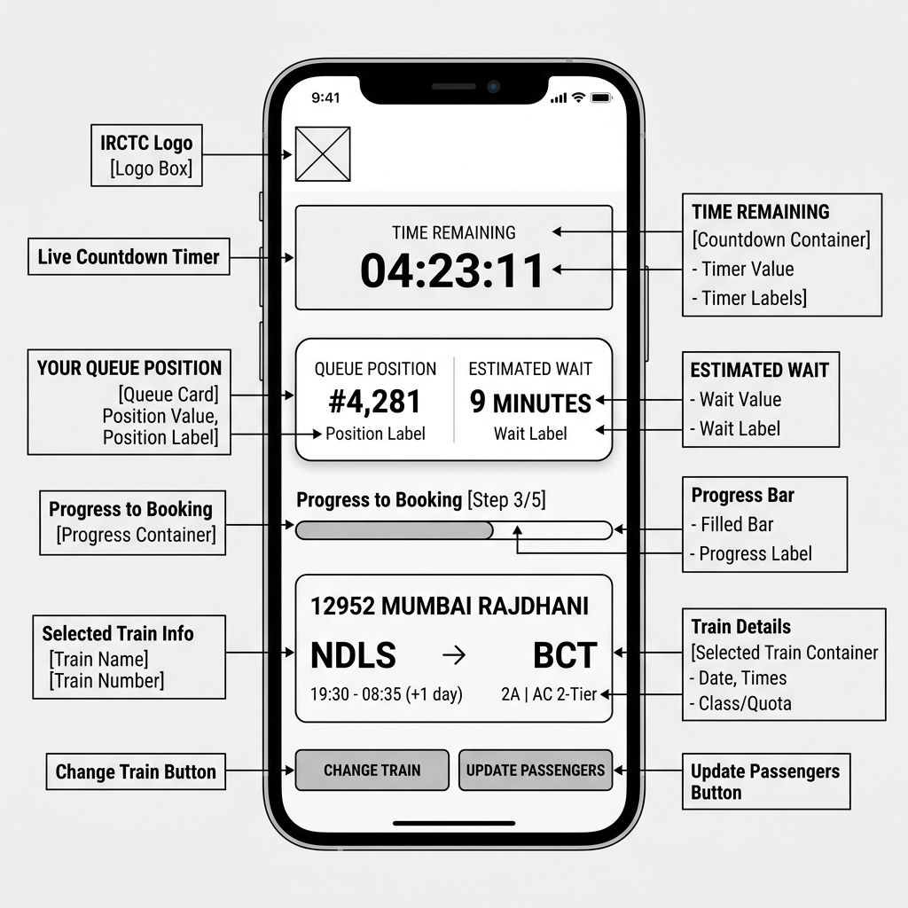
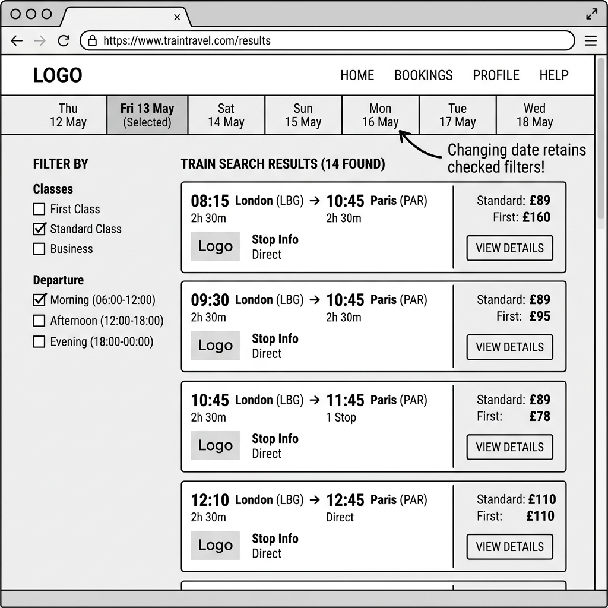
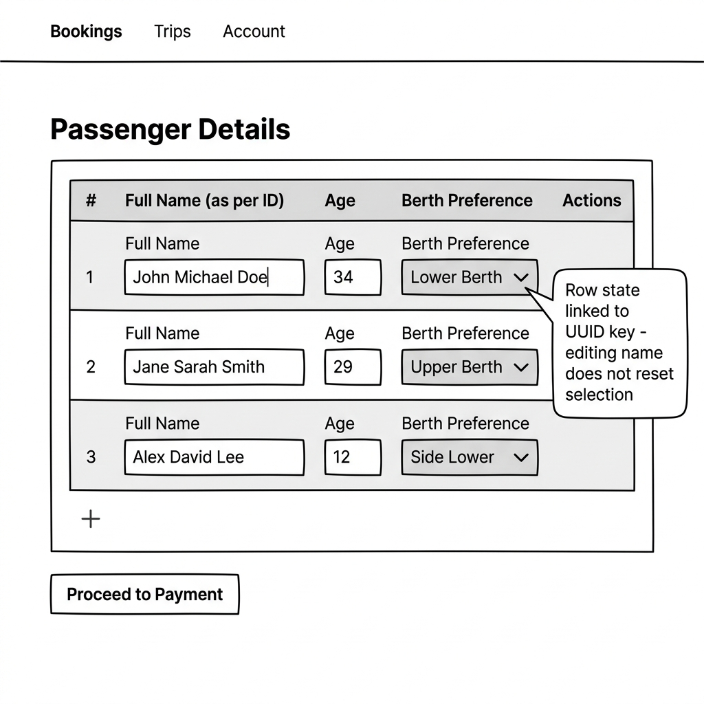
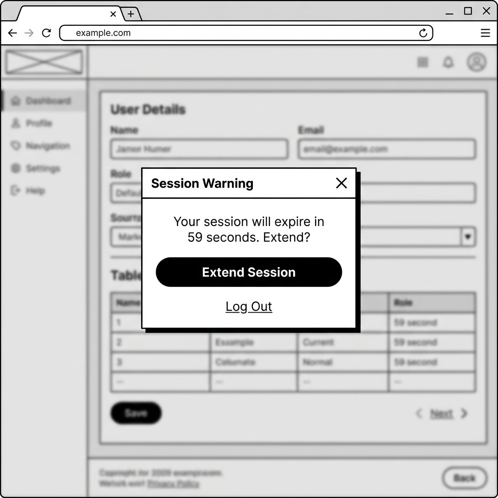
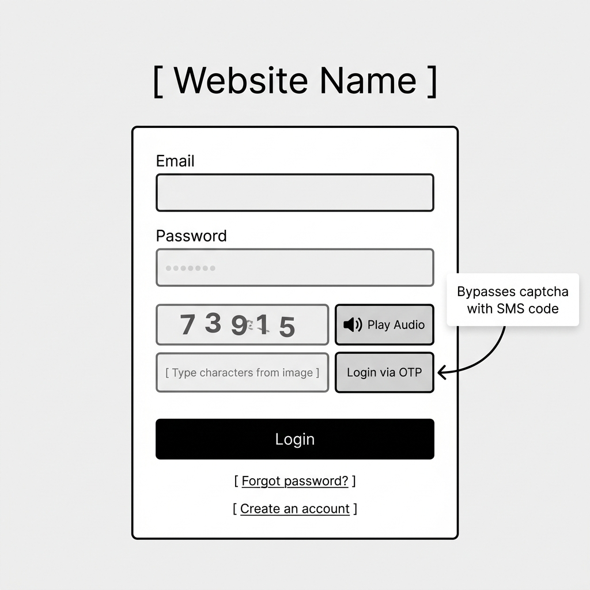
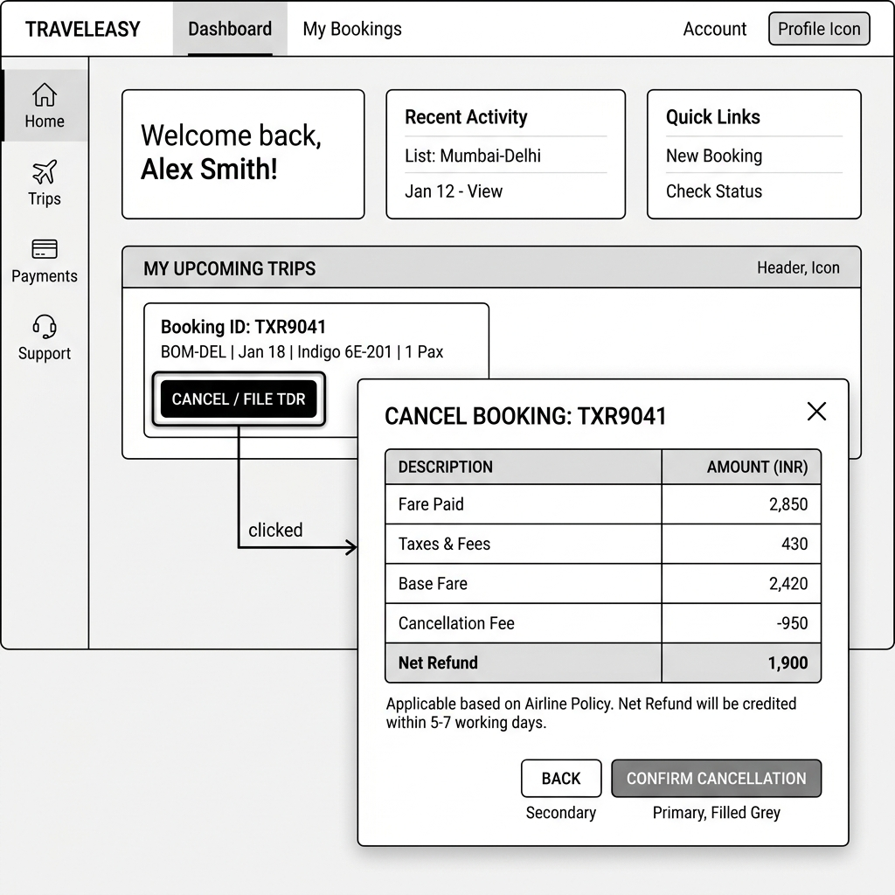

# Part B — Feature Specifications: 6 Solutions for IRCTC Pain Points

This document contains detailed feature specifications for resolving the six major user experience and technical pain points identified in Part A.

---

## Feature Spec 1: Tatkal Virtual Queue & Capacity Control

### Problem Statement
Under extreme traffic loads during Tatkal booking windows (10:00 AM for AC, 11:00 AM for Non-AC), the platform's backend servers crash due to concurrency limits. Passengers face infinite loading states, dropped sessions, and transaction failures, preventing genuine travelers from booking. (Refer to `PROBLEMS.md` Section 1).

### Current State (from Part A)
At exactly 10:00 AM, thousands of concurrent users click the class availability button. This triggers an immediate, unthrottled read/write database load. The server becomes overloaded, resulting in database connection drops, session logouts, or HTTP 503 errors, terminating user sessions mid-booking.

### Proposed Solution
Implement a **Virtual Queue (Waiting Room)** using Redis. Instead of immediately hitting the database when checking availability at peak hours, users are placed in a queue. The UI displays their queue position, an estimated wait time, and a live progress bar. As booking capacity becomes available, users are systematically transferred to the details entry and checkout steps.

### Proposed User Flow — Step by Step
1. User logs in at 9:58 AM and searches for a train.
2. User reaches the search results page and selects a class (e.g., 3A) under the Tatkal quota.
3. If peak hours are active, instead of loading seats directly, the system joins the queue and shows a "Virtual Waiting Room" screen.
4. The screen shows: "Queue Position: #4,281", "Estimated Wait Time: 4 minutes", and a live progress bar.
5. When the user's turn arrives, they are redirected to the passenger details entry page with an active queue token.
6. The user enters details, inputs captcha, and proceeds to checkout without server lags.
7. User completes payment and receives the confirmed ticket.

### Technical Implementation Plan

**System components affected:**
- Backend API (Routing and Session middleware)
- Redis Cache Cluster (Queue state storage)
- Frontend Booking Client (Queue status page and polling component)

**New data requirements:**
- **Queue Token Schema** in Redis: `queue_token` (UUID), `user_id` (String), `status` (`queued`, `active`, `expired`), `expires_at` (Timestamp), `position` (Integer).

**API changes:**
- `POST /api/v1/queue/join`
  - *What it does:* Joins the Tatkal queue for a specific train and class.
  - *Request Body:* `{ "trainNumber": "12622", "class": "3A", "quota": "CK" }`
  - *Response:* `{ "queueToken": "abc-123", "position": 4521, "estWaitSeconds": 240 }`
- `GET /api/v1/queue/status`
  - *What it does:* Polls current position and status.
  - *Request Headers:* `Authorization: Bearer <queueToken>`
  - *Response:* `{ "position": 120, "estWaitSeconds": 10, "status": "queued" }` or `{ "status": "active", "checkoutUrl": "/booking/checkout?token=abc-123" }`

**Frontend changes:**
- A new **Virtual Queue Page Component** (`TatkalQueueScreen`) displaying a card with the live countdown, position, and animated progress bar.
- Polling mechanism (using SSE - Server-Sent Events or WebSockets if supported, falling back to HTTP polling every 3 seconds).

**Third-party services:**
- Amazon ElastiCache (Redis) to manage high-speed in-memory queuing.

### Success Metrics
- Tatkal server uptime increases to 99.9% during peak hours (10:00 - 10:15 AM).
- Average checkout checkout completion rate increases from 40% to 80%.
- API transaction error rate (HTTP 503) drops below 1%.

### Edge Cases and Constraints
- **Queue Position Expiry & Lock (Updated post-Peer Review):** If a user reaches the front of the queue but does not complete booking within 5 minutes, their queue token expires. The associated seat hold is automatically released back to the inventory pool, and the user is redirected to the queue tail. This blocks inactive users from holding high-demand seats indefinitely.
- **Payment Failure:** If payment fails at the gateway, the user is given a grace period of 3 minutes to retry payment without re-entering the queue.

### Wireframe

*Caption: Proposed Tatkal virtual queue screen — mobile view*

---

## Feature Spec 2: Persistent Search Filters (URL Parameter Syncing)

### Problem Statement
When users apply filters on search results, the configuration is lost if they change the travel date or edit the search. The filters reset, forcing the user to re-select all options. (Refer to `PROBLEMS.md` Section 2).

### Current State (from Part A)
Filters are kept in transient component state. Triggering a new date query via "Next Day" tab changes re-initializes the parent search component, wiping the filter selections.

### Proposed Solution
Synchronize the search filter configuration with URL query parameters. Changing dates or modifying search inputs modifies the route path, retaining active filter parameters in the URL query string. The filters are automatically re-applied on the new search results payload.

### Proposed User Flow — Step by Step
1. User searches for trains and applies filters (e.g., 3A and 2A classes, morning departure).
2. The URL updates to `/search?from=SBC&to=MAS&date=2026-07-02&classes=3A,2A&departure=morning`.
3. User clicks the "Next Day" tab to see availability for July 3rd.
4. The page reloads the results for July 3rd, but the URL maintains `classes=3A,2A&departure=morning`.
5. The search results immediately load with the applied filters already active and checked.

### Technical Implementation Plan

**System components affected:**
- Frontend Router (React Router/Next.js router state)
- Search Page Component and filter sidebar

**New data requirements:**
- None.

**API changes:**
- None. (Uses existing search API endpoint with query parameters forwarded from URL).

**Frontend changes:**
- Bind filter checkboxes to the URL router state.
- Create a utility function `parseQueryParamsToFilterState()` to extract and apply active filters on initial load and path changes.

**Third-party services:**
- None.

### Success Metrics
- Time-to-filter-selection drops to 0 seconds on subsequent date navigation.
- Average search-to-booking clicks decrease by 15%.

### Edge Cases and Constraints
- **Invalid Parameters:** If the URL query contains invalid filter names, the router silently ignores them and falls back to default empty state.
- **Deep Linking:** Users can copy the search results URL and share it with others; the link will load with the exact filters applied.

### Wireframe

*Caption: Proposed persistent search filters UI showing date modification retaining active filters*

---

## Feature Spec 3: Berth Preference State Preservation

### Problem Statement
Berth preference selections silently revert to "No Preference" if the user edits any passenger text inputs or adds new passenger rows, resulting in wrong bookings. (Refer to `PROBLEMS.md` Section 3).

### Current State (from Part A)
The passenger inputs are managed inside a single array. Editing an input or adding a row causes the parent state array to recreate its indexes, resetting form dropdown elements to default states.

### Proposed Solution
Refactor the passenger details form structure to assign a unique identifier (UUID) as the `key` to each passenger row component. Changes in text fields will update specific object fields in state, preventing full re-renders that reset the select dropdowns.

### Proposed User Flow — Step by Step
1. User opens the passenger details screen and enters details for Passenger 1.
2. User selects "Lower Berth" as the berth preference.
3. User adds Passenger 2 by clicking "Add Passenger".
4. Passenger 2 row is added; Passenger 1 row remains unaffected with "Lower Berth" selected.
5. User edits a spelling typo in Passenger 1's name.
6. The berth preference for Passenger 1 remains "Lower Berth".

### Technical Implementation Plan

**System components affected:**
- Frontend Passenger Details form component.

**New data requirements:**
- React component state item structure: `{ id: "uuid-1", name: "John", age: 34, berthPreference: "LB" }`.

**API changes:**
- None.

**Frontend changes:**
- Refactor the passenger form loop to use a unique UUID key (instead of array index `$index`) in the mapping loop.
- Implement isolated component states or memoize the row inputs using `React.memo` to restrict state changes only to modified inputs.

**Third-party services:**
- None.

### Success Metrics
- Berth preference mismatch complaints drop to 0.
- Average passenger entry time drops by 10% due to fewer re-entries.

### Edge Cases and Constraints
- **Clear Form Action:** If a user clicks the "Reset Form" button, all preferences are cleared intentionally.

### Wireframe

*Caption: Proposed Passenger details form with key-based row updates preserving berth preferences*

---

## Feature Spec 4: Visible Session Timeout Countdowns & Keep-Alive Heartbeats

### Problem Statement
The aggressive 3-5 minute session timeout in IRCTC happens silently without warning, logging the user out and wiping all details mid-entry. (Refer to `PROBLEMS.md` Section 4).

### Current State (from Part A)
User spends time entering details. In the background, the server-side cookie expires. The user is logged out only after clicking "Submit", losing all entered data.

### Proposed Solution
Add a visible countdown timer bar at the top of the booking screen. When the timer hits 60 seconds, display an overlay modal warning the user and offering a "Extend Session" button, which fires an API request to refresh the session token.

### Proposed User Flow — Step by Step
1. User enters the passenger details page. A subtle progress bar at the top shows: "Session expires in 05:00".
2. User takes time typing. After 4 minutes, the timer hits 1 minute and turns amber.
3. A modal pops up: "Your session is about to expire due to inactivity. Do you need more time?".
4. User clicks "Extend Session".
5. The modal closes, the timer resets to 05:00, and all form data is preserved.
6. User completes the form and proceeds to payment.

### Technical Implementation Plan

**System components affected:**
- Frontend main layout.
- Session API router.

**New data requirements:**
- None.

**API changes:**
- `POST /api/v1/auth/session-extend`
  - *What it does:* Refreshes the active JWT/cookie session validity.
  - *Request Body:* Empty (reads session cookie).
  - *Response:* `{ "status": "success", "newExpiry": "300s" }`

**Frontend changes:**
- A central timer hook (`useSessionTimer`) synced with the session token lifetime.
- A **Session Timeout Modal Component** (`SessionTimeoutModal`) with countdown numbers and action button.

**Third-party services:**
- None.

### Success Metrics
- Session-expired logout rates on booking forms drop from 25% to under 2%.
- Customer drop-offs due to timeout frustrations drop by 80%.

### Edge Cases and Constraints
- **Unattended Session & Refresh Abuse Limit (Updated post-Peer Review):** If the user does not click "Extend Session" within 60 seconds, the client saves an encrypted local draft of the booking details and logs out. To prevent bot scripts from abusing keep-alive requests, a single login session is restricted to a maximum of 3 extensions (15 additional minutes), after which a hard re-authentication is enforced.

### Wireframe

*Caption: Proposed session timeout alert modal and top countdown bar*

---

## Feature Spec 5: Clean SVG Captchas & Reliable Audio/OTP Authentication

### Problem Statement
Standard image captchas are distorted and hard to read, causing loops of login failures. The audio captcha feature is broken, making the app inaccessible to visually impaired users. (Refer to `PROBLEMS.md` Section 5).

### Current State (from Part A)
Distorted alphanumeric PNG captchas are served. The audio captcha fails to load or plays incomprehensible noise, creating accessibility blockers.

### Proposed Solution
Replace noisy PNG captchas with clean SVG-based captchas that contain readable fonts with subtle vector distortion. Implement a reliable HTML5 Web Audio API audio captcha stream. Additionally, offer an OTP-based password-less login option.

### Proposed User Flow — Step by Step
1. User clicks "Login".
2. Along with Username/Password fields, a clear, high-contrast SVG captcha appears.
3. Visually impaired users can click the "Listen" button. A clear, human-like voice reads out the digits via the browser's audio interface.
4. If the user prefers, they click "Login via Mobile OTP".
5. They enter their mobile number, receive a 6-digit OTP, enter it, and bypass the captcha entirely.

### Technical Implementation Plan

**System components affected:**
- Login & Checkout Gateway API.
- Captcha generator microservice.
- OTP SMS Gateway integration.

**New data requirements:**
- None.

**API changes:**
- `GET /api/v1/captcha/generate`
  - *Response:* `{ "captchaId": "c-992", "svgString": "<svg>...</svg>" }`
- `GET /api/v1/captcha/audio/:captchaId`
  - *Response:* Audio stream (`audio/mpeg`) reading the captcha digits clearly.
- `POST /api/v1/auth/otp-request`
  - *Request:* `{ "mobile": "9876543210" }`
- `POST /api/v1/auth/otp-verify`
  - *Request:* `{ "mobile": "9876543210", "otp": "123456" }`

**Frontend changes:**
- Create an **Improved Captcha Component** with clean styling and contrast toggle.
- Create a "Login via OTP" modal/toggle.

**Third-party services:**
- Twilio / SMS Gateway API for OTP delivery.

### Success Metrics
- Login success rate on first attempt increases from 55% to 90%.
- Accessibility compliance score (WCAG 2.1 AA) achieved for login/checkout.

### Edge Cases and Constraints
- **SMS Gateway Latency:** If the OTP SMS is delayed by over 30 seconds, a "Resend OTP via Voice Call" option is provided.

### Wireframe

*Caption: Proposed login screen featuring clean SVG captcha and OTP authentication option*

---

## Feature Spec 6: Direct Dashboard Cancellation & Interactive Refund Estimates

### Problem Statement
Ticket cancellation and TDR filing options are deeply buried in nested sub-menus. The lack of refund calculations forces users to parse external PDF documents to guess refund amounts. (Refer to `PROBLEMS.md` Section 6).

### Current State (from Part A)
Cancellation is hidden under profile transactions. Clicking "Cancel" shows warning codes and external link redirects, without calculating the refund amount inside the UI.

### Proposed Solution
Add an "Active Trips" dashboard widget on the homepage. Each trip card features a direct "Cancel / File TDR" action. Clicking this opens a modal showing an interactive breakdown of the refund estimate (Total ticket cost - cancellation fee = net refund).

### Proposed User Flow — Step by Step
1. User logs into the IRCTC homepage.
2. The user sees their upcoming trip to Delhi in the "My Active Trips" section on the dashboard.
3. User clicks "Cancel Booking".
4. A modal overlay opens, displaying: "Fare Paid: ₹840", "Cancellation Charge: ₹120 (Standard AC 3 Tier Fee)", and "Net Refund Amount: ₹720".
5. User selects the reason for cancellation from a simple dropdown.
6. User clicks "Confirm Cancellation". The refund is initiated, and a tracking ID is shown.

### Technical Implementation Plan

**System components affected:**
- Homepage Dashboard.
- Booking & Cancellation API Service.
- Refund Engine.

**New data requirements:**
- **Refund Transaction Schema**: `refund_id` (UUID), `ticket_id` (String), `status` (`initiated`, `processed`, `settled`), `refund_amount` (Decimal), `cancellation_charge` (Decimal), `payment_mode` (String).

**API changes:**
- `POST /api/v1/tickets/:id/cancellation-preview` (Updated post-Peer Review)
  - *What it does:* Computes the estimated refund and charges. To prevent overloading backend CRIS mainframes, this API is called lazily on-demand when the user clicks "Cancel" to open the modal, rather than eager-loading all estimates on dashboard load.
  - *Response:* `{ "ticketId": "t-11", "originalFare": 840.00, "charges": 120.00, "refundAmount": 720.00, "feeRulesApplied": "Standard Cl. 47" }`
- `POST /api/v1/tickets/:id/cancel`
  - *What it does:* Finalizes the cancellation.
  - *Request Body:* `{ "reasonCode": "TRAIN_DELAYED" }`
  - *Response:* `{ "status": "cancelled", "refundId": "ref-552", "refundStatus": "initiated" }`

**Frontend changes:**
- Add **Active Trips Card Widget** on homepage.
- Create **Refund Breakdown Modal** component.

**Third-party services:**
- Internal CRIS (Center for Railway Information Systems) refund calculator API.

### Success Metrics
- Support tickets/queries regarding cancellation refund amounts drop by 60%.
- Time to initiate a cancellation/TDR drops from 2 minutes to under 20 seconds.

### Edge Cases and Constraints
- **Chart Prepared:** If the train chart is already prepared, online cancellation is disabled. The system displays a clear message directing the user to "File TDR" instead, with rules explained on screen.

### Wireframe

*Caption: Proposed Active Trips dashboard widget showing refund calculator preview modal*
